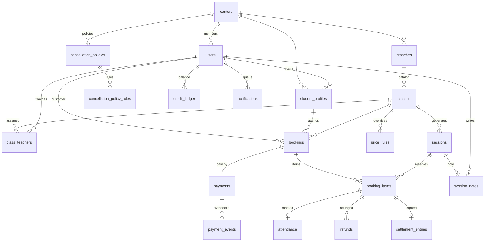

# Data Model & Schema — v1

Database: **PostgreSQL 16+**. All IDs `BIGSERIAL`. All timestamps `TIMESTAMPTZ` (UTC storage; render in `branches.timezone`). Money in **BIGINT IDR** (no decimals). Tenant-filtering: every table carries `center_id` (multi-tenant-ready per PRD §7; UI is single-tenant).

---

## 1. Design Principles

1. **Sessions are materialized facts.** The schedule rule on a class is only a generation template. Sessions become independent rows the moment they're created — they can be rescheduled/cancelled individually (BR-7), and bookings reference sessions, never rules.
2. **Prices are snapshotted at booking time.** Booking items store `unit_price` (resolved price / package share) permanently. Later price-rule edits never retroactively change booked money.
3. **Money tables are append-only.** `payments`, `refunds`, `credit_ledger`, `payment_events`, `settlement_entries` are never updated destructively — states transition forward, and every movement has a row you can trace (FR-8.3 money trail).
4. **Derived where possible, materialized where reporting demands it.** "Earned" is materialized in `settlement_entries` (reporting + future Mode 2 readiness); everything else (available seats, credit balance, exposure) is derived by query.
5. **The database enforces what must never break.** Overbooking (row lock), double webhook processing (unique event id), double main teacher (partial unique index), duplicate refunds (app guard + audit rows).
6. **One payment per booking, one booking per payment.** No partial multi-payment v1; store credit can be the payment method (full amount only).

---

## 2. Entity Relationship



---

## 3. Entity Catalog

### 3.1 Identity & Tenancy

**centers** — one row per learning center (v1: one per deployment).

| Column | Type | Notes |
|---|---|---|
| id | BIGSERIAL PK | |
| name | TEXT NOT NULL | |
| currency | CHAR(3) NOT NULL DEFAULT 'IDR' | |
| refund_destination | ENUM('gateway_then_credit','credit_only') DEFAULT 'gateway_then_credit' | FR-6.3 |
| midtrans_merchant_id | TEXT NULL | gateway config |
| midtrans_server_key_enc | TEXT NULL | encrypted at rest |
| midtrans_client_key | TEXT NULL | |
| is_production | BOOLEAN DEFAULT false | sandbox ↔ live = config flip (PRD SC-2) |
| default_cancellation_policy_id | BIGINT NULL FK → cancellation_policies | added via ALTER after both tables exist |

**users** — admin | teacher | customer (PRD §2).

| Column | Type | Notes |
|---|---|---|
| id | BIGSERIAL PK | |
| center_id | BIGINT NOT NULL FK | |
| email | TEXT NOT NULL | UNIQUE (center_id, email) |
| name | TEXT NOT NULL | |
| phone | TEXT NULL | |
| password_hash | TEXT NULL | invite tokens live in the auth layer, not here |
| role | ENUM('admin','teacher','customer') NOT NULL | single role v1; a `user_roles` join is the documented upgrade |
| status | ENUM('active','invited','suspended') DEFAULT 'active' | |

**student_profiles** — the attendee (PRD §2 note: parents book *for* a profile).

| Column | Type | Notes |
|---|---|---|
| id | BIGSERIAL PK | |
| center_id | BIGINT NOT NULL FK | |
| customer_id | BIGINT NOT NULL FK → users | owner account |
| name | TEXT NOT NULL | |
| birth_date | DATE NULL | age derived |
| notes | TEXT NULL | |

### 3.2 Catalog & Scheduling

**branches** — branch offices of one organization (PRD Decision §10.5). Teachers, customers, and students are organization-wide; only classes belong to a branch.

| Column | Type | Notes |
|---|---|---|
| id | BIGSERIAL PK | |
| center_id | BIGINT NOT NULL FK | |
| name | TEXT NOT NULL | |
| address | TEXT NULL | |
| timezone | TEXT NOT NULL | session rendering — WIB/WITA/WIT |
| status | ENUM('active','archived') DEFAULT 'active' | |

**classes** — the bookable item (series or one-off, unified per PRD §3).

| Column | Type | Notes |
|---|---|---|
| id | BIGSERIAL PK | |
| center_id | BIGINT NOT NULL FK | |
| branch_id | BIGINT NOT NULL FK → branches | every class happens at one branch |
| title, description | TEXT | |
| schedule | JSONB NOT NULL | generation template, two documented shapes: `{"type":"one_off","date":"2025-01-10","start":"16:00","end":"17:00"}` or `{"type":"weekly","days":[5],"start_date":"2025-01-04","weeks":8,"start":"16:00","end":"17:00"}`. Validated in app; sessions materialized at create (FR-2.2) |
| capacity | INT NOT NULL CHECK (> 0) | default for generated sessions |
| base_price | BIGINT NOT NULL CHECK (>= 0) | per session, IDR (FR-3.1) |
| package_price | BIGINT NULL CHECK (>= 0) | whole series (FR-3.1) |
| cancellation_policy_id | BIGINT NULL FK | NULL → center default (FR-6.1) |
| status | ENUM('draft','published','archived') DEFAULT 'draft' | |
| created_by | BIGINT FK → users | |

**class_teachers** — 1 main + N co (FR-2.1).

| Column | Type | Notes |
|---|---|---|
| class_id | BIGINT FK | |
| teacher_id | BIGINT FK → users | |
| role | ENUM('main','co') NOT NULL | |

Indexes/invariants: `UNIQUE (class_id, teacher_id)`; **partial unique** `ON class_id WHERE role='main'` → max one main in the DB itself.

**sessions** — materialized, independently mutable (FR-2.2).

| Column | Type | Notes |
|---|---|---|
| id | BIGSERIAL PK | |
| center_id, class_id | FK | |
| starts_at, ends_at | TIMESTAMPTZ NOT NULL | CHECK ends_at > starts_at |
| capacity | INT NOT NULL CHECK (>= 0) | snapshot from class at generation; editable per session |
| status | ENUM('scheduled','cancelled') DEFAULT 'scheduled' | "completed" is derived from `ends_at` |
| cancelled_reason | TEXT NULL | |

### 3.3 Pricing & Policy

**price_rules** — overrides per exact date or day-of-week (FR-3.2).

| Column | Type | Notes |
|---|---|---|
| id | BIGSERIAL PK | |
| center_id, class_id | FK | |
| rule_type | ENUM('date','dow') NOT NULL | |
| applies_on | DATE NULL | CHECK: required iff rule_type='date' |
| day_of_week | SMALLINT NULL CHECK (0–6) | required iff rule_type='dow' |
| price | BIGINT NOT NULL CHECK (>= 0) | absolute override of per-session price |
| valid_from, valid_to | DATE NULL | |

Precedence (BR-1) resolved in application code: **exact date > day-of-week > base**.

**cancellation_policies** + **cancellation_policy_rules** — ordered cutoffs (FR-6.1).

| Table.Column | Type | Notes |
|---|---|---|
| policies.id | BIGSERIAL PK | + center_id, name, timestamps |
| rules.policy_id | FK CASCADE | |
| rules.hours_before | INT NOT NULL CHECK (>= 0) | UNIQUE (policy_id, hours_before) |
| rules.refund_percent | SMALLINT NOT NULL CHECK (0–100) | |

Evaluation: `rule with max(hours_before) where hours_before <= hours_until_start`; if none, the rule with `min(hours_before)` is the "else" floor (BR-6's lowest cutoff). Policy must have ≥1 rule (app invariant).

### 3.4 Booking & Money

**bookings** — one per purchase intent (single session or series).

| Column | Type | Notes |
|---|---|---|
| id | BIGSERIAL PK | |
| center_id, customer_id, student_profile_id, class_id | FK | |
| code | TEXT NOT NULL UNIQUE | public human-readable id, e.g. `BK-2025-000123` |
| booking_type | ENUM('session','series') NOT NULL | |
| status | ENUM('pending_payment','paid','cancelled','partially_cancelled') DEFAULT 'pending_payment' | convenience flag, maintained by app; items hold granular truth |
| package_price | BIGINT NULL | snapshot at booking (series only); series bookings open only until first session starts (PRD §10.4) |

**booking_items** — one row per reserved session; the unit of seat-counting, refund, attendance, settlement.

| Column | Type | Notes |
|---|---|---|
| id | BIGSERIAL PK | |
| center_id, booking_id, session_id | FK | UNIQUE (booking_id, session_id) |
| status | ENUM('pending_payment','confirmed','cancelled','completed','no_show') DEFAULT 'pending_payment' | see state machine §4 |
| unit_price | BIGINT NOT NULL | **snapshot**: resolved price for single-session bookings; `package_price` split across items for series via `allocate()` (remainder distributed to earliest items — Dinero.js convention) |
| cancelled_at | TIMESTAMPTZ NULL | |
| cancel_reason | TEXT NULL | expired / customer / rescheduled / admin |

**payments** — exactly one per booking.

| Column | Type | Notes |
|---|---|---|
| id | BIGSERIAL PK | |
| center_id, booking_id | FK UNIQUE | |
| method | ENUM('qris','va','manual','store_credit') NOT NULL | |
| status | ENUM('pending','paid','failed','expired') DEFAULT 'pending' | refund state lives in `refunds`, not here |
| amount | BIGINT NOT NULL CHECK (>= 0) | |
| currency | CHAR(3) DEFAULT 'IDR' | |
| gateway_order_id, gateway_transaction_id | TEXT NULL | Midtrans ids |
| qr_string | TEXT NULL | QRIS payload to render (FR-5.1) |
| expires_at | TIMESTAMPTZ NOT NULL | seat-hold deadline; default now()+30min for QRIS, longer for VA (BR-2) |
| paid_at | TIMESTAMPTZ NULL | |

**payment_events** — webhook audit + idempotency.

| Column | Type | Notes |
|---|---|---|
| payment_id | FK | |
| gateway_event_id | TEXT NOT NULL | **UNIQUE** → duplicate webhooks can never double-apply |
| event_type, payload JSONB, received_at | | raw gateway notification |

**refunds** — append-only, one or more per booking item (policy refund, then possible admin override).

| Column | Type | Notes |
|---|---|---|
| id | BIGSERIAL PK | |
| center_id, booking_item_id | FK | |
| amount | BIGINT NOT NULL CHECK (> 0) | app guard: Σrefunds per item ≤ unit_price |
| method | ENUM('gateway','store_credit') NOT NULL | BR-8/B-9 decide at execution |
| status | ENUM('pending','succeeded','failed') DEFAULT 'pending' | failed → automatic credit fallback (BR-8) |
| reason | ENUM('policy','admin_override','reschedule') NOT NULL | BR-7 uses 'reschedule' |
| gateway_refund_id | TEXT NULL | |
| created_by | BIGINT NULL FK → users | NULL = system |

**credit_ledger** — store credit (v1-simple, FR-6.3).

| Column | Type | Notes |
|---|---|---|
| center_id, customer_id | FK | balance = SUM(amount) per customer |
| amount | BIGINT NOT NULL | + credit in, − spend |
| entry_type | ENUM('refund_credit','payment_spend','adjustment') NOT NULL | |
| ref_booking_item_id, ref_payment_id | BIGINT NULL | traceability back to the money trail |

**settlement_entries** — the "earned" ledger (FR-8).

| Column | Type | Notes |
|---|---|---|
| booking_item_id | FK UNIQUE | created when item becomes `confirmed` |
| amount | BIGINT NOT NULL | = unit_price snapshot |
| earned_at | TIMESTAMPTZ NULL | set by job when session `ends_at` passes and item is confirmed/completed/no_show (BR-5) |

- **Earned revenue** = `SUM(amount) WHERE earned_at IS NOT NULL − refunds`
- **Refund exposure** = `SUM(amount) WHERE earned_at IS NULL − refunds on those items`

### 3.5 Operations

**attendance** — per booking item (FR-7).

| Column | Type | Notes |
|---|---|---|
| booking_item_id | FK UNIQUE | |
| status | ENUM('present','absent') NOT NULL | |
| marked_by | FK → users | any assigned teacher (Decision #3) |
| marked_at | TIMESTAMPTZ NULL | |
| auto_resolved | BOOLEAN DEFAULT false | job sets `absent` 24h after session end (FR-7.2) |

**session_notes** — one editable note per session (FR-7.3).

| Column | Type | Notes |
|---|---|---|
| session_id | FK UNIQUE | |
| body | TEXT NOT NULL | free text — curriculum structure deliberately absent (PRD §7) |
| author_id, updated_at | | any assigned teacher may edit |

**notifications** — minimal email queue (FR-9).

| Column | Type | Notes |
|---|---|---|
| user_id | FK | |
| type | TEXT | booking_confirmed, payment_receipt, reminder_24h, cancellation, refund, revenue_summary |
| payload | JSONB | |
| sent_at | TIMESTAMPTZ NULL | NULL = queued (partial index for the worker) |

---

## 4. State Machines

**booking_items** (the core):

```
pending_payment ──(payment paid)──▶ confirmed ──(session ends, attendance present)──▶ completed
      │                                │    └──(session ends, attendance absent)─────▶ no_show
      │                                └──(customer/admin cancel; reschedule)────────▶ cancelled
      └──(payment expired/failed)────────────────────────────────────────────────────▶ cancelled
```

- `no_show` triggers policy evaluation at the lowest cutoff — typically 0% → no refund row (BR-6).
- `settlement_entries.earned_at` is set for confirmed/completed/no_show when the session ends (BR-5).

**payments**: `pending ─▶ paid | failed | expired`. Expiry is a scheduled job: any `pending` past `expires_at` → `expired`, and its `pending_payment` items → `cancelled` (seats released, BR-2).

**sessions**: `scheduled ─▶ cancelled`. Rescheduling a session with booked items = cancel those items with `cancel_reason='rescheduled'`, full refund (BR-7).

---

## 5. Critical Invariants

| # | Invariant | Enforcement |
|---|---|---|
| I-1 | Overbooking impossible | `SELECT … FOR UPDATE` on session row inside the booking transaction; count active items before insert (§6.1) |
| I-2 | Exactly one main teacher per class | Partial unique index on `class_teachers(class_id) WHERE role='main'` |
| I-3 | No double webhook application | UNIQUE `payment_events.gateway_event_id` |
| I-4 | Prices immutable after booking | `booking_items.unit_price` snapshot; rules/classes never write back |
| I-5 | Refund ≤ what was paid per item | App guard: Σrefunds(item) ≤ unit_price; refund rows append-only |
| I-6 | Credit never negative | Spend guarded by balance check inside payment creation tx |
| I-7 | No duplicate active seat per profile per session | App check (unique active items per (student_profile_id, session_id)); noted as future DB trigger |
| I-8 | Every confirmed item has a settlement row | Same tx as confirmation |

---

## 6. Critical Queries

**6.1 Seat lock + booking creation (FR-4.4, atomic):**

```sql
BEGIN;
SELECT id FROM sessions WHERE id = $1 FOR UPDATE;          -- serializes bookings per session
SELECT COUNT(*) FROM booking_items bi
JOIN payments p ON p.booking_id = bi.booking_id
WHERE bi.session_id = $1
  AND (bi.status = 'confirmed'
    OR (bi.status = 'pending_payment' AND p.status = 'pending' AND p.expires_at > now()));
-- if count >= session.capacity → rollback "no seats"
INSERT INTO bookings …; INSERT INTO booking_items …; INSERT INTO payments …;
COMMIT;
```

**6.2 Price resolution (BR-1):**

```sql
SELECT COALESCE(
  (SELECT price FROM price_rules
    WHERE class_id = $1 AND rule_type = 'date' AND applies_on = $2
      AND (valid_from IS NULL OR valid_from <= $2)
      AND (valid_to   IS NULL OR valid_to   >= $2)),
  (SELECT price FROM price_rules
    WHERE class_id = $1 AND rule_type = 'dow' AND day_of_week = EXTRACT(DOW FROM $2)
      AND (valid_from IS NULL OR valid_from <= $2)
      AND (valid_to   IS NULL OR valid_to   >= $2)),
  (SELECT base_price FROM classes WHERE id = $1)) AS price;
```

**6.3 Teacher conflict check (FR-2.3 — spans all branches automatically; teachers are organization-wide):**

```sql
SELECT 1 FROM sessions s
JOIN class_teachers ct ON ct.class_id = s.class_id
WHERE ct.teacher_id = $1 AND s.status = 'scheduled'
  AND s.starts_at < $new_ends_at AND s.ends_at > $new_starts_at
LIMIT 1;
```

**6.4 Earned revenue & refund exposure (FR-8.3):**

```sql
-- earned revenue per class
SELECT c.title, SUM(se.amount) - COALESCE(SUM(r.amount), 0) AS earned
FROM settlement_entries se
JOIN booking_items bi ON bi.id = se.booking_item_id
JOIN sessions s ON s.id = bi.session_id
JOIN classes c ON c.id = s.class_id
LEFT JOIN refunds r ON r.booking_item_id = bi.id
WHERE se.earned_at IS NOT NULL
GROUP BY c.title;

-- refund exposure (paid, class not yet ended)
SELECT SUM(se.amount) - COALESCE(SUM(r.amount), 0)
FROM settlement_entries se
JOIN booking_items bi ON bi.id = se.booking_item_id
LEFT JOIN refunds r ON r.booking_item_id = bi.id
WHERE se.earned_at IS NULL;
```

**6.5 Expiry job (BR-2):**

```sql
UPDATE payments SET status = 'expired'
WHERE status = 'pending' AND expires_at < now();
-- then cancel affected items and release seats (single tx per payment)
```

---

## 7. Deliberately Absent (v1)

No `withdrawals` table (money is not gated — PRD §5.1). No waitlists, rooms/resources, curriculum tables, multi-role joins, credit expiry, ledger for gateways' own fees, gateway payout APIs, branch-scoped admin roles, or SaaS tenant provisioning. All are future seams, not missing pieces.

## 8. Future-Proofing Notes

- **Multi-tenant:** `center_id` on every table; composite indexes `(center_id, …)`; every query is center-scoped. Branches are already first-class in v1 via `branches`. Going SaaS (separate businesses) = add a platform table + super-admin provisioning + login routing. No schema migration.
- **Platform escrow (Mode 2):** `settlement_entries` already separates *earned* from *paid*; escrow becomes a flag on the center (disburse after `earned_at`) + a `disbursements` table. No changes to booking/money tables.
- **Multi-role users:** replace `users.role` with a `user_roles` join; nothing else moves.
