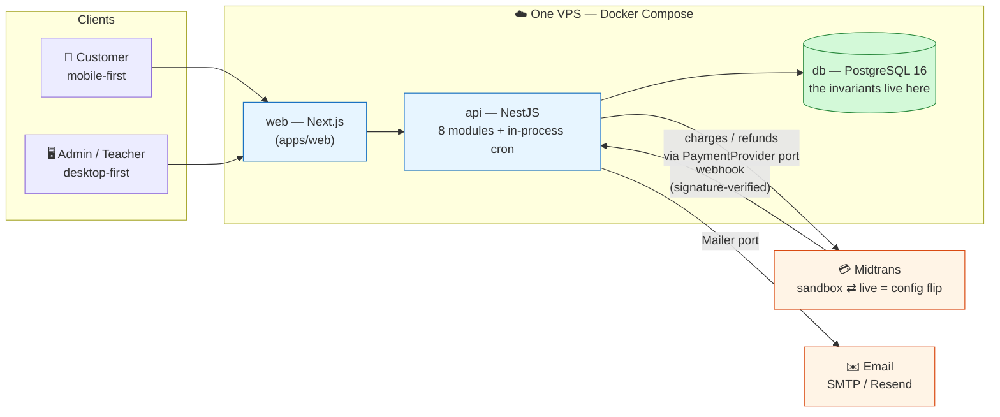
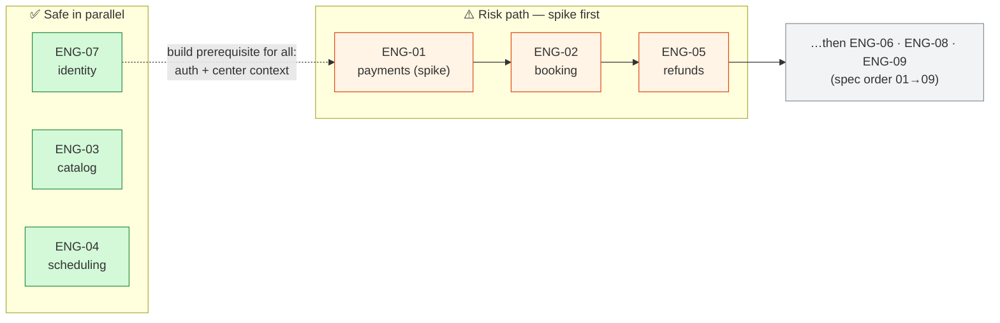
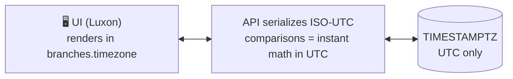
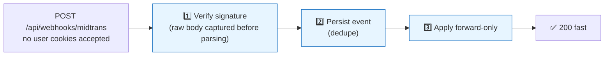
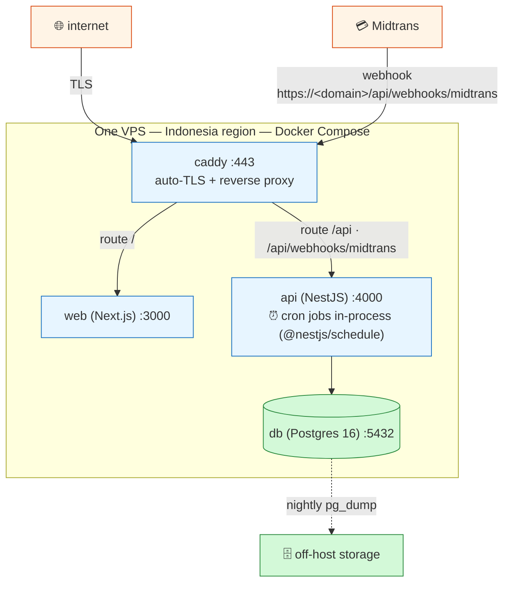

# ENG-00 — High-Level Architecture (umbrella)


| | |
|---|---|
| **Status** | Draft |
| **PRD refs** | §1 (success criteria), §5.1, §6 (NFRs), §7 (scope), §9 (milestones), §10 (decisions) |
| **Schema refs** | all of [SCHEMA.md](../SCHEMA.md) — esp. §1 (design principles), §5 (invariants), §8 (future-proofing) |
| **Downstream consumers** | every ENG-01…09 spec — decisions here are made once and not re-litigated downstream |

## Contents

| | | | |
|---|---|---|---|
| 1 | [Why this spec exists](#1-why-this-spec-exists) | 7 | [Deployment topology](#7-deployment-topology-single-instance) |
| 2 | [Goals / Non-goals](#2-goals--non-goals) | 8 | [Environments](#8-environments) |
| 3 | [Tech stack](#3-tech-stack) | 9 | [Testing strategy](#9-testing-strategy) |
| 4 | [Repository layout](#4-repository-layout) | 10 | [Acceptance criteria](#10-acceptance-criteria) |
| 5 | [Module map → specs → PRD FRs](#5-module-map-nestjs--specs--prd-frs) | 11 | [Open questions](#11-open-questions) |
| 6 | [Cross-cutting decisions](#6-cross-cutting-decisions-made-once) | 12 | [Breakdown issues](#12-breakdown-issues) |

## At a glance

> 💡 **The big idea:** one deployable **modular monolith** for one learning center — Next.js + NestJS + PostgreSQL — with every rule that cuts across slices (time, money, idempotency, audit, webhook security, center scoping) pinned **once** in §6 and referenced, never redefined, by ENG-01…09.



---

## 1. Why this spec exists

Sub-specs (ENG-01…09) each own one domain slice. This umbrella owns everything that cuts **across** slices: the stack, the module map, the deployment shape, and the cross-cutting rules (time, money, idempotency, audit, webhook security, center scoping). If a decision affects two or more sub-specs, it lives here; sub-specs reference, never redefine.

## 2. Goals / Non-goals

**🎯 Goals**

| # | Goal |
|---|---|
| **G1** | One deployable unit for one learning center (PRD SC-2): single instance, Docker Compose, sandbox→live as config flip |
| **G2** | Module boundaries that map 1:1 onto ENG-01…09 so specs can be built in the README's dependency order without rework |
| **G3** | Cross-cutting rules pinned once: UTC + branch-tz rendering, BIGINT IDR, append-only money tables, idempotency, audit trail, webhook security, center-scoped queries |
| **G4** | Mobile-first customer UI, desktop-first admin/teacher UI (PRD §1.4) from one Next.js app |

**🚫 Non-goals (v1)**

- Multi-center SaaS provisioning, horizontal scaling, queue workers as separate processes, platform escrow (PRD §5.1 Mode 2). Schema stays ready; architecture stays single-instance.
- Server-side rendering of admin pages for SEO — there is no SEO surface; customer browse pages are the only public surface and even those sit behind a center URL.

## 3. Tech stack

| Layer | Choice | Why / notes |
|---|---|---|
| Language | TypeScript end-to-end | one language across web/api/shared |
| Monorepo | pnpm workspaces: `apps/web`, `apps/api`, `packages/shared` | shared types & zod schemas; no Turborepo needed at this size |
| Frontend | **Next.js** (App Router) | customer pages mobile-first; admin/teacher responsive desktop-first |
| UI kit | Tailwind CSS + shadcn/ui | fast, presentable admin for the demo (PRD §8) |
| Data/forms | TanStack Query + react-hook-form + zod resolvers | client cache; forms validate against shared schemas |
| Backend | **NestJS** (Express adapter), REST + OpenAPI (`@nestjs/swagger`) | modular DI fits the ENG-01…09 module map; Swagger UI doubles as demo material |
| Database | **PostgreSQL 16** (per SCHEMA.md) | row locks, partial unique indexes, append-only tables — the invariants live here |
| ORM | **Drizzle** (`drizzle-orm` + `drizzle-kit`) | schema-as-TypeScript: CHECK constraints, partial unique indexes, and ENUMs (SCHEMA §5 invariants) are declared in the typed schema and generated into migrations — the schema file doubles as the invariant inventory. Typed `.for('update')` + `sql<T>` fragments cover SCHEMA §6 critical queries (seat lock, price resolution) with no untyped raw-SQL surface. Zero runtime deps, no codegen step (pnpm/Docker-friendly). Migrations: `docs/schema.sql` is the baseline the TS schema mirrors 1:1; drizzle-kit generates and evolves SQL migrations from it |
| Validation | zod schemas in `packages/shared`, applied via Nest pipes | one source of truth, client and server |
| Auth | HTTP-only session cookie (DB-backed `sessions` table, owned by ENG-07); argon2id password hashing; invite tokens for teachers | no JWT/localStorage; no mobile app in v1; `SameSite=Lax` + CSRF token on mutations |
| Scheduling | `@nestjs/schedule` cron **in the API process** | single instance ⇒ no leader election. Jobs: payment expiry (BR-2), attendance auto-resolve (FR-7.2), settlement earn-marker (BR-5), reminder-24h (FR-9), notification sender |
| Email | `Mailer` port; default Nodemailer/SMTP, provider switchable by env (Resend/SES) | ENG-09 owns templates; WhatsApp post-MVP |
| Dates/times | **Luxon** everywhere | first-class IANA timezones for WIB/WITA/WIT |
| Money | **Dinero.js v2** (`number` calculator, `IDR` currency; plain integers at DB/JSON edges) | immutable, currency-typed money; `allocate()` covers package price-share, `multiply()` with explicit rounding covers refund %; sums stay ≪ 2⁵³ for a single center; format at UI edge via `Intl.NumberFormat('id-ID')` |
| Encryption at rest | AES-256-GCM via `node:crypto`, key from `APP_ENCRYPTION_KEY` env | for `centers.midtrans_server_key_enc` |
| Logging | `nestjs-pino` JSON logs + request id; audit via append-only tables (XD-5) | Sentry optional, off by default |
| Tests | Jest + Supertest (api), Vitest (web), Playwright e2e of the §8 demo script; Postgres in docker-compose for CI; ENG-01 MockAdapter ⇒ zero network in CI | |
| Infra | one VPS, Docker Compose: `caddy` (auto-TLS + reverse proxy), `web`, `api`, `db` | single region (Indonesia); nightly `pg_dump` off-host |

**❌ Rejected, with reasons**

| Rejected | Why |
|---|---|
| GraphQL / tRPC | REST + OpenAPI demos better to clients |
| Redis / BullMQ | single instance; cron + DB tables suffice |
| Microservices | one deployable unit |
| Auth.js / Lucia | backend owns auth; ENG-07 specs the table |
| Prisma | schema language can't express CHECK constraints or partial unique indexes — SCHEMA §5 invariants would live in handwritten SQL, invisible in `schema.prisma`; §6 critical queries fall back to untyped `$queryRaw`, which client extensions don't intercept (XD-8 hole); codegen + postinstall friction under pnpm |

## 4. Repository layout

```
apps/
  web/            Next.js — routes grouped (customer) / (admin) / (teacher)
  api/            NestJS — src/modules/<domain>, one per §5 row
    src/common/   center-context, money, clock, idempotency, audit helpers
    src/db/       Drizzle schema (mirrors docs/schema.sql 1:1), client, generated migrations
    src/jobs/     cron entrypoints (thin; logic lives in modules)
packages/
  shared/         zod DTOs, error codes, role enum, BR constants (e.g. QR_EXPIRY_MINUTES=30)
docker-compose.yml
docs/  PRD.md  prototypes/
```

> [!NOTE]
> `packages/shared` must stay free of Nest/Next imports — plain TS so both apps and CI scripts can use it.

## 5. Module map (NestJS) → specs → PRD FRs

| Nest module | Owns (tables) | Spec | PRD FRs |
|---|---|---|---|
| `identity` | centers, users, sessions(auth), student_profiles, branches | ENG-07 | FR-1 |
| `catalog` | classes, class_teachers, sessions, price_rules | ENG-03, ENG-04 | FR-2, FR-3 |
| `booking` | bookings, booking_items | ENG-02 | FR-4 |
| `payments` | payments, payment_events + `PaymentProvider` port | ENG-01 | FR-5 |
| `refunds` | refunds, credit_ledger, cancellation_policies(+rules) | ENG-05 | FR-6 |
| `settlement` | settlement_entries, revenue queries | ENG-06 | FR-8 |
| `attendance` | attendance, session_notes | ENG-08 | FR-7 |
| `notifications` | notifications, Mailer port, templates | ENG-09 | FR-9 |

> **📏 Boundary rules**
> 1. A table is **written by exactly one module**. Others read freely (SQL joins across boundaries are fine — this is a modular monolith, not microservices).
> 2. State machines live with their owning module: `payments` status in `payments`, `booking_items` status in `booking`, transitions called through application services (SCHEMA §4).
> 3. Cross-module side effects go through explicit service calls inside the caller's transaction where consistency demands it (e.g., payment `paid` → confirm items + insert settlement rows, one tx, per ENG-01 §4.3).
> 4. Ports/adapters: `PaymentProvider` (ENG-01), `Mailer` (ENG-09) are constructor-injected interfaces; MockAdapter is the default outside production.

**🗺️ Build order** (from specs README): risk path ENG-01(spike) → ENG-02 → ENG-05; ENG-07/03/04 safe in parallel; spec order 01→09. ENG-07 is the build prerequisite for everything (auth + center context) but is specced lean.



## 6. Cross-cutting decisions (made once)

| # | Decision | One-liner |
|---|---|---|
| **XD-1** | ⏰ Time | Store UTC only; render in branch timezone at the edge |
| **XD-2** | 💰 Money | BIGINT IDR end-to-end; Dinero.js in app, plain integers at the edges |
| **XD-3** | 📒 Append-only money tables | Forward-only transitions; corrections are new rows, never edits |
| **XD-4** | 🔁 Idempotency | Webhook dedupe · client `Idempotency-Key` · `gateway_order_id` · DB constraints as backstop |
| **XD-5** | 🧾 Audit | `created_by` + `payment_events` trail + cancel metadata; no separate audit table in v1 |
| **XD-6** | 🔐 Webhook security | Signature-verified, raw body, dedupe, fast 200; no user cookies |
| **XD-7** | 🔒 Transactions & locking | `SELECT … FOR UPDATE` serializes bookings; read committed suffices |
| **XD-8** | 🏢 Center scoping | Scoped wrapper injects `center_id` into every query; RLS is the future upgrade |
| **XD-9** | ⚙️ Config | zod-validated env, fail fast; sandbox↔live = config flip only |
| **XD-10** | 🔌 API conventions | `/api/v1`, error envelope, cursor pagination, generated OpenAPI |

### XD-1 · ⏰ Time



Store UTC `TIMESTAMPTZ` only. Render in `branches.timezone` at the edge (API serializes ISO-UTC; UI converts with Luxon). Comparisons (cutoffs, expiry, marking windows) are instant math in UTC. Day-of-week / calendar-date rules (price rules, schedule generation) are computed **in the branch timezone**, then stored as UTC instants. Cron jobs schedule in UTC.

### XD-2 · 💰 Money

BIGINT IDR end-to-end (SCHEMA §1); no float crosses any boundary. In app code, money is a **Dinero.js v2** object; at DB and JSON edges it is a plain integer (Prisma BIGINT ↔ `toSnapshot().amount`). Division happens once — `package_price` split across items via `allocate()` (remainder distributed to the earliest items, SCHEMA §3.4) — and is snapshotted into `booking_items.unit_price`. Refund percentages use `multiply()` with an explicit rounding mode (mode pinned in ENG-05). Formatting is display-only (`Intl.NumberFormat('id-ID')`, IDR has no minor units).

### XD-3 · 📒 Append-only money tables

`payments`, `payment_events`, `refunds`, `credit_ledger`, `settlement_entries` accept forward-only status transitions; corrections are new rows, never edits. Guards live in the owning module's service; nobody `UPDATE`s another module's money rows.

### XD-4 · 🔁 Idempotency

| Layer | Mechanism |
|---|---|
| (a) Webhooks | unique `gateway_event_id`; duplicate = ack 200 no-op (I-3, ENG-01 §4.3) |
| (b) Client mutations | `Idempotency-Key` header required on `POST /bookings`; key stored with the created booking so safe-retry returns the original |
| (c) Gateway calls | our `gateway_order_id` is the idempotency token (ENG-01 §4.1) |
| (d) Backstop | unique DB constraints catch it even if app logic races |

### XD-5 · 🧾 Audit

Every money/refund row carries `created_by` (NULL = system). `payment_events` is the raw webhook trail. Booking-item cancellations keep `cancelled_at` + `cancel_reason`. Request logs carry actor id + request id. This satisfies FR-8.3's money trail without a separate audit table in v1.

### XD-6 · 🔐 Webhook security



`POST /api/webhooks/midtrans` is unauthenticated-by-user but **signature-verified** (ENG-01 `parseWebhook`); raw body captured before parsing (Express `rawBody`). Verify → persist event (dedupe) → apply forward-only → 200 fast. No user cookies accepted on webhook routes; Midtrans IP allowlist optional defense-in-depth behind Caddy.

### XD-7 · 🔒 Transactions & locking

Service methods own tx boundaries. `SELECT … FOR UPDATE` on the session row serializes bookings (I-1, SCHEMA §6.1) — via Drizzle `db.transaction()` + the typed `.for('update')` locking clause (`sql<T>` fragments for the rest of §6). Default isolation (read committed) is sufficient; no serializable transactions in v1.

### XD-8 · 🏢 Center scoping

Request context resolves `center_id` (v1: the single center row); modules never receive the raw Drizzle client — a center-scoped wrapper (`src/common/center-context`) injects `center_id` into every query, and every table carries the column (SCHEMA §8). If multi-center SaaS ever happens, the upgrade is Postgres RLS (`SET app.center_id` per tx) — Drizzle declares RLS policies in-schema, so it's additive, not a rewrite. Kept strict now for the same reason.

### XD-9 · ⚙️ Config

Env validated with zod at boot (fail fast). Secrets only in env, never in DB except `midtrans_server_key_enc` (encrypted, §3). **Sandbox↔live is a config flip**: `centers.is_production` + gateway keys + base URL selection in the adapter; no code branches on environment (PRD SC-2, ENG-01 G5).

### XD-10 · 🔌 API conventions

`/api/v1/…`; error envelope `{ "error": { "code", "message", "details?" } }` with codes exported from `packages/shared`; cursor pagination (`?cursor=`) on list endpoints; OpenAPI generated from Nest decorators and published in the repo.

## 7. Deployment topology (single instance)



- Midtrans webhook target: `https://<domain>/api/webhooks/midtrans` — public via Caddy; no tunnel needed in production, `ngrok`-style tunnel acceptable for local sandbox testing.
- One compose file for prod; `docker-compose.dev.yml` adds hot-reload + exposed db port.
- Backup/restore: nightly `pg_dump`, documented restore drill; append-only money tables make point-in-time reasoning easy but are **not** a backup substitute.
- 📈 Scaling story if ever needed: db → managed Postgres, api → N replicas behind Caddy with jobs pinned to one replica (env flag), web → CDN. Documented here so the single-instance choice is a decision, not an accident.

## 8. Environments

| Env | Purpose | Gateway | DB |
|---|---|---|---|
| 🧑‍💻 local dev | laptop | MockAdapter (Midtrans sandbox on demand) | docker-compose Postgres |
| 🤖 CI | Jest/Vitest/Playwright | MockAdapter only, zero network | ephemeral Postgres service |
| 🎭 staging/demo | the §8 demo script, `is_production=false` | Midtrans sandbox, real webhooks via tunnel/staging URL | persistent |
| 🚀 prod | real center | live keys via config flip only | persistent + backups |

## 9. Testing strategy

| Layer | Tools | What it proves |
|---|---|---|
| **Unit** | Jest (api) / Vitest (web) | pricing resolution (BR-1), policy evaluation (BR-3/6), price-share division (BR-4) — pure functions in modules |
| **API integration** | Supertest + real Postgres | every invariant I-1…I-8 gets one test; seat-lock overbooking test fires N concurrent booking requests and asserts capacity is never exceeded |
| **Contract** | shared suite: MockAdapter + MidtransAdapter | sandbox behavior is provably mirrored by the mock (ENG-01 §4) |
| **E2E** | Playwright | the 10-minute demo script (PRD §8) is the smoke suite for staging |

## 10. Acceptance criteria

- [ ] **AC-1** — `pnpm dev` brings up web+api+db from a clean clone with one compose command; the §8 demo runs end-to-end against MockAdapter with zero external network.
- [ ] **AC-2** — Every §6 decision is enforced somewhere checkable: UTC-only columns (migration lint), integer money types (shared zod), append-only guard tests, webhook replay test, center-scope wrapper test.
- [ ] **AC-3** — OpenAPI spec generates and matches `packages/shared` DTOs.
- [ ] **AC-4** — Sandbox↔live flip demonstrated by config diff only (ENG-01 AC-6 depends on this).
- [ ] **AC-5** — Backup restore drill documented and executed once on staging.

## 11. Open questions

| # | Question | Owner / timing |
|---|---|---|
| **OQ-1** | Hosting target for the single VPS (provider/region) | needed before staging; does not block build |
| **OQ-2** | Email provider for the demo (plain SMTP vs Resend) | ENG-09 decides; Mailer port is unaffected |
| **OQ-3** | Bahasa Indonesia copy source of truth (PRD §10.2) — assume a `packages/shared` i18n dictionary | confirm before ENG-09 templates |
| **OQ-4** | Session cookie vs short-lived token if a mobile app appears post-MVP | noted seam; ENG-07 owns the decision when it matters |

## 12. Breakdown issues

Tickets below cover only what this umbrella owns; each ENG-01…09 spec breaks down its own domain slice. `Depends on` links to the blocking issue.

### Foundation & scaffolding

| Ticket | Title | Scope | Depends on | Link |
|---|---|---|---|---|
| **ENG-00-01** | Monorepo scaffold (`pnpm` workspaces: `apps/web`, `apps/api`, `packages/shared`) | §4 | — | [#1](https://github.com/wachidbaharudin/book-class-prototype/issues/1) |
| **ENG-00-02** | Dev compose + Postgres service (hot-reload, exposed db port) | §7, §8 | [#1](https://github.com/wachidbaharudin/book-class-prototype/issues/1) | [#2](https://github.com/wachidbaharudin/book-class-prototype/issues/2) |
| **ENG-00-03** | Prod compose topology (`caddy`/`web`/`api`/`db`) + backup & restore drill | §7, AC-5 | [#1](https://github.com/wachidbaharudin/book-class-prototype/issues/1), [#2](https://github.com/wachidbaharudin/book-class-prototype/issues/2) | [#3](https://github.com/wachidbaharudin/book-class-prototype/issues/3) |
| **ENG-00-04** | `packages/shared`: zod DTOs, error codes, role enum, BR constants (framework-free) | §3, §4 | [#1](https://github.com/wachidbaharudin/book-class-prototype/issues/1) | [#4](https://github.com/wachidbaharudin/book-class-prototype/issues/4) |
| **ENG-00-05** | Drizzle schema mirroring `docs/schema.sql` 1:1 + baseline migration | §3 | [#1](https://github.com/wachidbaharudin/book-class-prototype/issues/1) | [#5](https://github.com/wachidbaharudin/book-class-prototype/issues/5) |

### Cross-cutting platform (§6)

| Ticket | Title | Scope | Depends on | Link |
|---|---|---|---|---|
| **ENG-00-06** | Config module: zod-validated env, fail-fast; sandbox↔live as config flip | XD-9 | [#1](https://github.com/wachidbaharudin/book-class-prototype/issues/1) | [#6](https://github.com/wachidbaharudin/book-class-prototype/issues/6) |
| **ENG-00-07** | Center-context scoped DB wrapper (injects `center_id`, no raw client) | XD-8 | [#5](https://github.com/wachidbaharudin/book-class-prototype/issues/5) | [#7](https://github.com/wachidbaharudin/book-class-prototype/issues/7) |
| **ENG-00-08** | Money helper: Dinero.js v2 internally, BIGINT IDR at edges, `allocate()` | XD-2 | [#4](https://github.com/wachidbaharudin/book-class-prototype/issues/4) | [#8](https://github.com/wachidbaharudin/book-class-prototype/issues/8) |
| **ENG-00-09** | Clock helper: UTC store, branch-tz rendering via Luxon, cron in UTC | XD-1 | [#4](https://github.com/wachidbaharudin/book-class-prototype/issues/4) | [#9](https://github.com/wachidbaharudin/book-class-prototype/issues/9) |
| **ENG-00-10** | Idempotency: client `Idempotency-Key`, `gateway_order_id`, dedupe constraints | XD-4 | [#5](https://github.com/wachidbaharudin/book-class-prototype/issues/5), [#7](https://github.com/wachidbaharudin/book-class-prototype/issues/7) | [#10](https://github.com/wachidbaharudin/book-class-prototype/issues/10) |
| **ENG-00-11** | Audit helpers: `created_by`, `payment_events` trail, cancel metadata | XD-5 | [#5](https://github.com/wachidbaharudin/book-class-prototype/issues/5), [#7](https://github.com/wachidbaharudin/book-class-prototype/issues/7) | [#11](https://github.com/wachidbaharudin/book-class-prototype/issues/11) |
| **ENG-00-12** | Transactions & locking primitives (tx boundary + `SELECT … FOR UPDATE` pattern) | XD-7 | [#5](https://github.com/wachidbaharudin/book-class-prototype/issues/5) | [#12](https://github.com/wachidbaharudin/book-class-prototype/issues/12) |
| **ENG-00-13** | API conventions: `/api/v1`, error envelope, cursor pagination, OpenAPI output | XD-10, AC-3 | [#4](https://github.com/wachidbaharudin/book-class-prototype/issues/4), [#6](https://github.com/wachidbaharudin/book-class-prototype/issues/6) | [#13](https://github.com/wachidbaharudin/book-class-prototype/issues/13) |
| **ENG-00-14** | Webhook plumbing: raw-body capture, signature verify, no-cookie route | XD-6 | [#6](https://github.com/wachidbaharudin/book-class-prototype/issues/6), [#13](https://github.com/wachidbaharudin/book-class-prototype/issues/13) | [#14](https://github.com/wachidbaharudin/book-class-prototype/issues/14) |
| **ENG-00-15** | Cron/jobs scaffolding (`@nestjs/schedule`, in-process, thin job entrypoints) | §3, §5 | [#6](https://github.com/wachidbaharudin/book-class-prototype/issues/6) | [#15](https://github.com/wachidbaharudin/book-class-prototype/issues/15) |

### Ports, extensions & verification

| Ticket | Title | Scope | Depends on | Link |
|---|---|---|---|---|
| **ENG-00-16** | Ports & adapters: `PaymentProvider` + `MockAdapter`, `Mailer` + default SMTP | §3, §5 | [#6](https://github.com/wachidbaharudin/book-class-prototype/issues/6), [#13](https://github.com/wachidbaharudin/book-class-prototype/issues/13) | [#16](https://github.com/wachidbaharudin/book-class-prototype/issues/16) |
| **ENG-00-17** | Web app shell: App Router groups, mobile-first customer / desktop-first admin, Tailwind + shadcn | §3, §4, G4 | [#1](https://github.com/wachidbaharudin/book-class-prototype/issues/1), [#4](https://github.com/wachidbaharudin/book-class-prototype/issues/4) | [#17](https://github.com/wachidbaharudin/book-class-prototype/issues/17) |
| **ENG-00-18** | Test harness: Jest+Supertest (api), Vitest (web), Playwright e2e, MockAdapter contract suite | §9 | [#5](https://github.com/wachidbaharudin/book-class-prototype/issues/5), [#16](https://github.com/wachidbaharudin/book-class-prototype/issues/16) | [#18](https://github.com/wachidbaharudin/book-class-prototype/issues/18) |
| **ENG-00-19** | CI pipeline: ephemeral Postgres, zero external network, migration/invariant lint (AC-2) | §8, §9, AC-2 | [#2](https://github.com/wachidbaharudin/book-class-prototype/issues/2), [#18](https://github.com/wachidbaharudin/book-class-prototype/issues/18) | [#19](https://github.com/wachidbaharudin/book-class-prototype/issues/19) |

