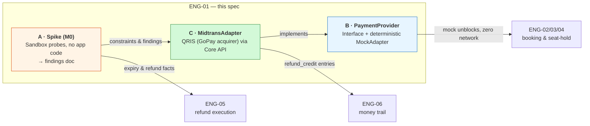
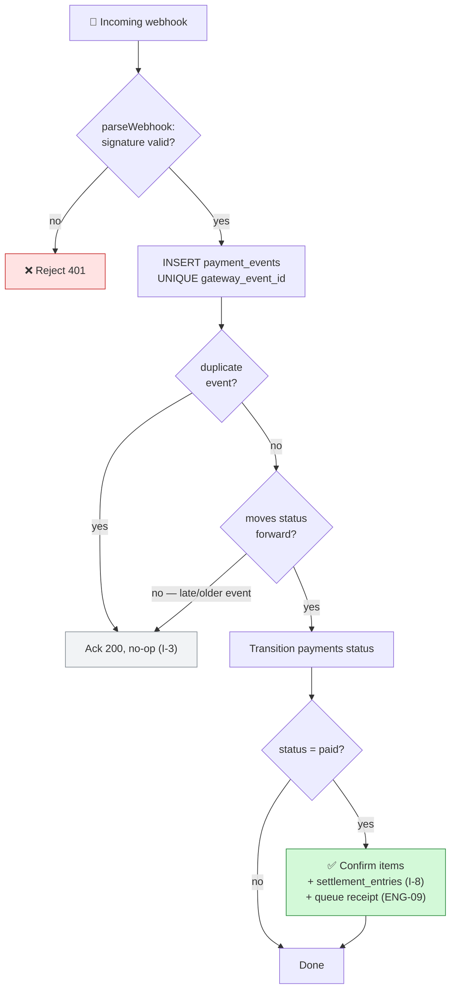
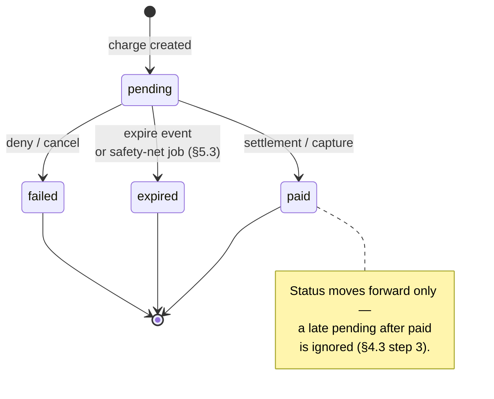
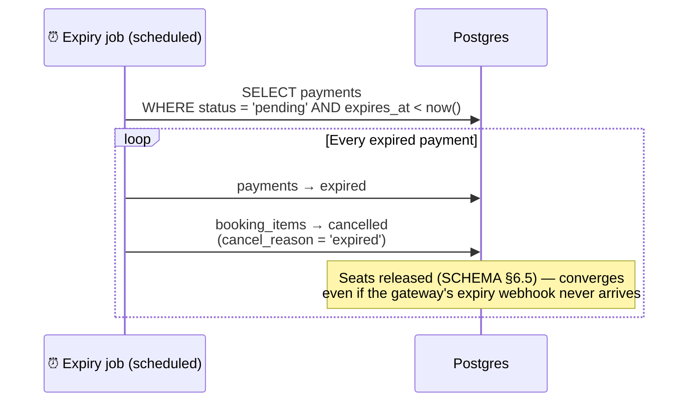
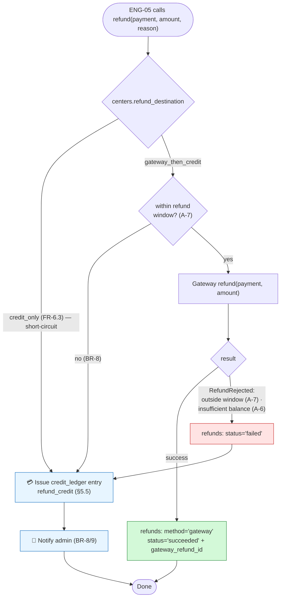

# ENG-01 — Payments: Midtrans Core API (QRIS, GoPay acquirer) Integration


| | |
|---|---|
| **Status** | Draft |
| **PRD refs** | FR-5, FR-6.3/6.4, BR-2, BR-8, BR-9, §5.1, §10 (open items 1 & 3) |
| **Schema refs** | `payments` · `payment_events` · `refunds` · `credit_ledger` · `centers.midtrans_*` / `is_production` / `refund_destination` |
| **Downstream consumers** | ENG-02 (seat-hold expiry) · ENG-05 (refund execution) · ENG-06 (money trail) |

## Contents

| | | | |
|---|---|---|---|
| 1 | [Why this spec is first](#1-why-this-spec-is-first) | 5 | [Deliverable C — MidtransAdapter](#5-deliverable-c--midtransadapter) |
| 2 | [Goals / Non-goals](#2-goals--non-goals) | 6 | [Edge cases](#6-edge-cases) |
| 3 | [Deliverable A — Spike (M0)](#3-deliverable-a--spike-m0) | 7 | [Acceptance criteria](#7-acceptance-criteria) |
| 4 | [Deliverable B — PaymentProvider + MockAdapter](#4-deliverable-b--paymentprovider-interface--mockadapter) | 8 | [Open questions](#8-open-questions-to-close-during-spike) |

## At a glance

> 💡 **The big idea:** payments is ranked first because of **risk, not build order**. The spike de-risks the only true external unknowns, while the app itself is built against a mock and never blocks on Midtrans.



---

## 1. Why this spec is first

Payments carries the project's only true external unknowns (PRD made it M0). The ranking is about **risk, not build order**: the spike must produce answers before ENG-02 and ENG-05 are designed, but the app itself is built against a mock and never blocks on Midtrans.

## 2. Goals / Non-goals

**🎯 Goals**

| # | Goal | Deliverable |
|---|---|---|
| **G1** | Prove the money rails in sandbox and document constraints as a findings doc | A |
| **G2** | `PaymentProvider` interface + deterministic MockAdapter so ENG-02/03/04 proceed without a gateway | B |
| **G3** | MidtransAdapter: QRIS (GoPay acquirer) charge via Core API (`POST /v2/charge`), webhook-verified confirmation, status polling, expiry, full & partial refunds with automatic store-credit fallback | C |
| **G4** | Idempotency everywhere — no double-charge, no lost payment, no double-applied webhook (PRD NFR, I-3) | B + C |
| **G5** | Sandbox → live is a config flip only (`centers.is_production` + keys), per PRD SC-2 | C |

**🚫 Non-goals (v1)**

- Manual bank-transfer flow (FR-5.4) — separate thin spec later; it shares only the `payments` table (`method='manual'`).
- **DANA + GoPay wallet deeplink** — DANA charge is Snap-only; GoPay deeplink (`payment_type: "gopay"`) is skipped to keep a single uniform QRIS channel (PRD §10.1). Not gaps.
- Store-credit *spending* mechanics (`method='store_credit'`) — owned by ENG-02/05; ENG-01 only issues credit entries as a refund fallback.
- Platform escrow / Iris disbursements (PRD §5.1 Mode 2).
- Gateway fee accounting, payout reconciliation.

## 3. Deliverable A — Spike (M0)

> 🔬 **Timeboxed sandbox probes** using Midtrans sandbox credentials, driven by scripts/curl — **no app code**.
> 📄 **Output:** `docs/spikes/midtrans-findings.md` answering each question below with observed evidence (request/response payloads).

| # | Probe | Question to answer | Downstream impact |
|---|---|---|---|
| A-1 | Create QRIS charge via Core API | Response shape; how the QR is delivered (`actions[].generate-qr-code` URL, not a raw string); render requirements | ENG-02 payment page |
| A-2 | QR expiry | Default expiry; is it configurable per charge (min/max); exact expiry event behavior | **ENG-02 seat-hold duration & release job (BR-2)** |
| A-3 | Webhook confirm | Signature/`signature_key` verification scheme; retry cadence; ordering guarantees (can `settlement` arrive before `pending`?); event id fields suitable for `payment_events.gateway_event_id` | ENG-01 idempotency design |
| A-4 | Full refund (unsettled txn) | API, response, webhook on refund, time-to-complete | ENG-05 happy path |
| A-5 | **Partial refund on GoPay-acquired QRIS** | Confirm documented full+partial support; per-transaction limits? multiple partials? off-us (bank-app scan) behavior | **ENG-05: confirms BR-9 credit fallback is edge case, not primary path (PRD §10.3, research §5.2)** |
| A-6 | Refund after settlement (T+1, low merchant balance) | Behavior when balance insufficient: error code? queued? partial? | **ENG-05 fallback + admin notification (BR-8)** |
| A-7 | Refund window | Confirm documented windows: GoPay-acquired QRIS on-us 45d / off-us 7d (research §5.2) | ENG-05 gateway-attempt precondition (BR-8) |
| A-8 | QRIS acquirer config | Confirm only the GoPay QRIS acquirer is active (so off-us bank-app scans stay refundable, research §5.6); `generate-qr-code` action-URL rendering; `custom_expiry` behavior; whether a failed/missed `generate-qr-code-v2` fallback exists | ENG-01 channel handling |
| A-9 | Status polling | `GET /v2/{order_id}/status` reliability; fields matching webhook truth (used while QR displayed, FR-5.1) | ENG-02 polling loop |
| A-10 | Failure & deny paths | Expired QR, cancelled payment, denied — which statuses/events arrive | ENG-02 state machine edges |

> ✅ **Exit criteria:** every question answered with evidence; unknowns escalated to PRD §10 open items; findings distilled into a constraints list consumed by ENG-02/05/06.

## 4. Deliverable B — `PaymentProvider` interface + MockAdapter

### 4.1 Interface (application layer)

```ts
// language-agnostic — TS-flavored for readability
interface PaymentProvider {
  createCharge(booking, expiryMinutes?): ChargeHandle;
  getStatus(gatewayOrderId): PaymentStatus;       // pending | paid | failed | expired
  refund(payment, amount, reason): RefundResult;  // throws RefundRejected on channel refusal
  parseWebhook(headers, rawBody): VerifiedEvent;  // throws on bad signature
}

interface ChargeHandle  { gatewayOrderId; qrCodeUrl; expiresAt; }
interface VerifiedEvent { gatewayEventId; gatewayOrderId; type; status; rawPayload; }
```

> [!IMPORTANT]
> **Rules**
> - All methods idempotent by `gateway_order_id` (= our `payments.id` namespaced, e.g. `BK-2025-000123-<n>` — retrying a charge for the same booking must not double-charge).
> - Money is **BIGINT IDR** end-to-end; no floats cross this boundary.
> - The provider **never writes booking/item state** — it returns outcomes; the app layer transitions `payments`/`booking_items` (keeps state machine ownership in one place, SCHEMA §4).

### 4.2 MockAdapter

Deterministic fake for dev/tests:

- `createCharge` → returns a fixed QR code URL; `expiresAt` = now + configured minutes.
- `getStatus` → driven by a scenario table keyed by `gatewayOrderId` suffix (e.g. `...-PAID`, `...-EXPIRE`, `...-FAIL`) so integration tests control outcomes.
- `parseWebhook` → accepts locally-signed events; same verification code path as the real adapter.
- `refund` → scenario-driven success/`RefundRejected`, including an `INSUFFICIENT_BALANCE` scenario to exercise the BR-9 credit fallback.

### 4.3 Webhook processing pipeline (shared by both adapters)



1. `parseWebhook` verifies signature → `VerifiedEvent` (reject 401 otherwise).
2. Insert into `payment_events` with `gateway_event_id`; **UNIQUE violation = duplicate → ack 200, no-op** (I-3).
3. Apply status transition to `payments` if it moves forward (`pending → paid | failed | expired`); never regress a `paid` payment on late/older events (A-3 finding).
4. On `paid`: same transaction confirms items, writes `settlement_entries` (I-8), queues receipt notification (ENG-09).

## 5. Deliverable C — MidtransAdapter

### 5.1 Charge (FR-5.1)

```mermaid
sequenceDiagram
    autonumber
    actor Cust as 🧑 Customer
    participant App as App layer
    participant DB as Postgres
    participant Prov as PaymentProvider
    participant M as Midtrans Core API

    Cust->>App: Checkout (QRIS)
    App->>DB: INSERT payments (status = pending)
    App->>Prov: createCharge(booking, expiryMinutes)
    Prov->>M: POST /v2/charge<br/>(order_id = namespaced payments.id)
    M-->>Prov: generate-qr-code action URL + expiry
    Prov-->>App: ChargeHandle
    App->>DB: Store qr_code_url / expires_at
    App-->>Cust: Render QR (FR-5.1)

    Note over App,M: While the QR is displayed the app polls getStatus — read-only;<br/>transitions still funnel through the §4.3 pipeline, so no races

    M-->>App: Webhook: settlement
    App->>App: parseWebhook → verify signature
    App->>DB: payment_events insert (dedupe) + payments → paid
    App->>DB: Confirm items + settlement_entries (I-8)
    App-->>Cust: Receipt notification (ENG-09)
```

- Core API `POST /v2/charge` with `payment_type: "qris"` + `qris: { acquirer: "gopay" }` (response `actions[]` carries `generate-qr-code`, a GET URL to the QR image). Store the QR action URL in `qr_code_url` and `expires_at` on `payments`. The merchant account keeps **GoPay as the only QRIS acquirer** so off-us (bank-app) scans stay refundable.
- Expiry: pass per-charge `custom_expiry` per A-2 finding; **default 30 min** (BR-2) — within GoPay QRIS bounds (20s–7d; Midtrans default 15 min).
- `centers.is_production=false` → sandbox base URL + sandbox keys; flip requires only config change (G5). Keys from `centers.midtrans_*`, server key encrypted at rest.

### 5.2 Confirmation: webhook is source of truth; poll is UX

Webhook pipeline per §4.3. Midtrans status mapping:

| Midtrans event | Payment transition |
|---|---|
| `settlement` / `capture` | `pending → paid` |
| `expire` | `pending → expired` |
| `deny` / `cancel` | `pending → failed` |
| `pending` | no-op |



The app also polls `getStatus` while the QR is displayed (FR-5.1) — poll only ever *reads*; transitions funnel through the same idempotent apply step as webhooks so race conditions are impossible.

> 📌 **Sources of truth — what changes `pending → paid`**
>
> - **Midtrans never writes to our DB.** *We* apply the transition when our app learns the status.
> - **Push (primary):** the webhook POST already carries `transaction_status: "settlement"`; verify `signature_key`, then apply. **Do not call `GET /v2/{id}/status` inside the webhook handler** — it is redundant, adds latency, and introduces a second failure mode. Re-fetching is optional defense-in-depth only.
> - **Pull (fallback/UX):** `GET /v2/{order_id or transaction_id}/status` also returns `settlement`. Used to poll while the QR is on screen and as a reconciliation job for missed webhooks. Same apply step, so ordering/duplicates are safe.
> - **Not app-inventable:** `pending → paid` can only originate from Midtrans (webhook or pull). The only transition our app drives by itself is `pending → expired` via the §5.3 safety-net job, which needs no gateway signal.

### 5.3 Expiry safety net (BR-2)



Scheduled job: `payments.pending` past `expires_at` → `expired`; its `pending_payment` items → `cancelled` with `cancel_reason='expired'`, releasing seats (SCHEMA §6.5). This must converge even if the gateway's expiry webhook never arrives.

### 5.4 Refunds (FR-6.4, BR-8, BR-9)

Called only by ENG-05 with a computed amount; this adapter owns execution:



1. **Precondition check** (BR-8): transaction age within refund window (A-7). If outside → skip gateway, issue credit.
2. `refund(payment, amount)` → on success record `refunds.method='gateway'`, `status='succeeded'` + `gateway_refund_id`.
3. On `RefundRejected` (outside window A-7, insufficient balance A-6): mark the refund row `failed`, then ENG-05's fallback path creates a `credit_ledger` `refund_credit` entry for the same amount and notifies admin (BR-8/9). Partial refunds are documented as supported on the QRIS channel (A-5 confirms), so rejection is the exception.
4. Full-cancellation refunds always attempt the gateway first (BR-9) even when center default is `credit_only`? — **No:** `centers.refund_destination='credit_only'` short-circuits to credit without a gateway attempt (FR-6.3); `gateway_then_credit` follows steps 1–3.

### 5.5 Store-credit issuance (fallback only)

`credit_ledger` append with `entry_type='refund_credit'`, `ref_booking_item_id` set for the money trail (ENG-06). Balance is derived (`SUM(amount)`), never stored.

## 6. Edge cases

| Case | Handling |
|---|---|
| Webhook arrives before our charge row is committed | `parseWebhook` + event insert succeed; apply step retries with backoff until `payments` row exists (order-id is the join key) |
| Duplicate webhook (retry storm) | UNIQUE `gateway_event_id` no-op (I-3) |
| Late `pending` after `paid` | Status moves forward only (§4.3 step 3) |
| Customer pays after QR expiry race | Gateway decides (rejects expired QR); if a `settlement` arrives for an `expired` payment, alert + auto-refund via gateway — flagged from A-2/A-10 findings |
| Refund succeeds at gateway but webhook missed | Reconcile via `getStatus`/refund-status endpoint in a daily job |
| Double refund attempt (admin + policy) | App guard: Σrefunds(item) ≤ `unit_price` (I-5), enforced in ENG-05's transaction |

## 7. Acceptance criteria

- [ ] **AC-1** — Spike findings doc merged; every §3 question answered or escalated.
- [ ] **AC-2** — MockAdapter: full booking-payment-expiry cycle runs in CI with zero network.
- [ ] **AC-3** — Sandbox: QRIS charge → webhook → `paid` → items `confirmed` + settlement rows, verifiably idempotent under webhook replay.
- [ ] **AC-4** — Sandbox: full and partial refunds execute on GoPay-acquired QRIS; forced `RefundRejected` produces credit fallback + admin notification.
- [ ] **AC-5** — Expiry job releases seats on expired QR without any webhook.
- [ ] **AC-6** — Sandbox↔live is a config diff only; no code path branches on environment beyond base URL + keys.

## 8. Open questions (to close during spike)

| # | Question | Answered by | Determines |
|---|---|---|---|
| **OQ-1** | Partial-refund behavior on GoPay-acquired QRIS (documented supported — research §5.2; spike confirms, incl. off-us) (PRD §10.3) | A-5 | ENG-05's partial path |
| **OQ-2** | QR expiry configurability bounds | A-2 | ENG-02 default |
| **OQ-3** | Merchant account ownership (PRD §10.1) — assumed center-owned keys in `centers` table; confirm | — | config model |
| **OQ-4** | Exact insufficient-balance behavior | A-6 | retry policy for `failed` gateway refunds before credit fallback |
